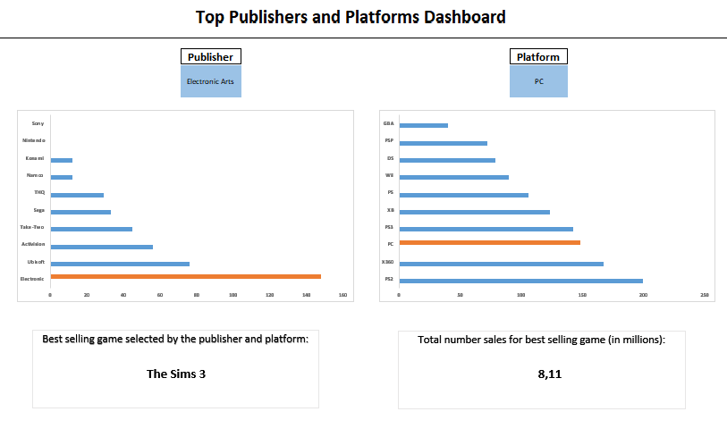
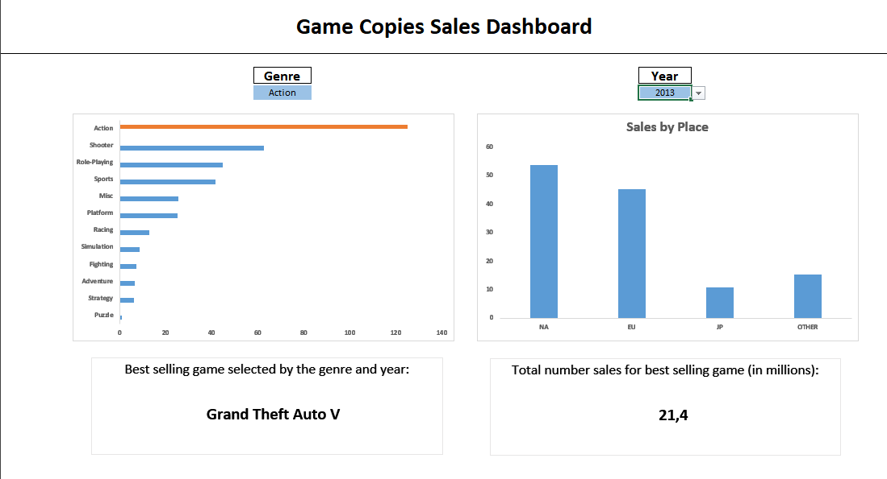

# 🎮 Excel Game Sales Dashboards Project

## 📚 Table of Contents
- **Project Overview**
- **Data Overview**
- **Structure Explanation**
- **How to Run**
- **Dashboards overview**
- **Technical Details**
- **Author**

## 🔎 Project Overview

This project provides two Excel Dashboards based on video game sales data. It allows you to explore the number of unique games sold by each publisher on a specific platform, as well as the total number of copies sold by genre and year. Results are visualized using charts and metrics, with the information about the name of the best selling game for selected categories alongs with the total number of sales. 

To view the Dashboard click here: [Game Sales Dashboards.xlsx](Game%20Sales%20Dashboards.xlsx).
</p>

## 📂 Data Overview

- `game_sales.csv` – contains game name, platform, release year, genre, publisher name, sales totals (NA, EU, Japan, other and global).

**Data source:** [Kaggle Video Game Sales Dataset](https://www.kaggle.com/datasets/gregorut/videogamesales) 


## 🧱 Structure Explanation

| Folder / File | Description |
|----------------|-------------|
| **data/** | Contains original data file |
| **images/** | Images of both Dashboards |
| **Game Sales Dashboards.xlsx** | Main project file |
| **README.md** | Project overview 

---

## ⚙️ How to Run

Download *.xlsx* file or click this link to view the online version: [Game Sales Dashboards Online Version](https://1drv.ms/x/c/AB2D013D2CBD952F/EQlvCT2bn1dFoW1a3QZszGYBEeWGeWZIFSZyJqUeUfCw9g?e=wIjRM7&nav=MTVfezgwRjY3ODAxLTlDNTItNDI5OS1BMTk4LTNGNTJDOTY2Nzc5MX0) 

## 📈 Dashboards Overview

### Dashboard 1 - Top Publishers and Platforms 

You can inspect the data on unique games sold by the selected publisher and platform from the list. Any changes to the values automatically update the charts. The orange bars represent the chosen filters. Results are sorted in ascending order. Below the charts you can find metrics displaying the top selling game for the chosen publisher and platform.

The dashboard is built using the **platform** and **publisher** sheets. To make the Dashboard more readable, the publishers and platforms are limited to the top 10 based on global sales (such as Electronic Arts, Activision, Ubisoft as well as PC, PSP, PS2 and so on).      




### Dashboard 2 - Game Copies Sales 

The second Dashboard works in the same way as the first one, but instead of exploring data by publisher and platform, you can analyze the total number of copies sold by selected genre and year. The left chart presents sales by game genre (action, sports, racing, etc.). The right chart shows sales by region - NA, EU, Japan and other.

The Dashboard is built using **genre** and **publisher** sheets. 




The metrics in both sheets are based on formulas located in the **metric** sheet. 

## 🖥️ Technical Details

### Excel skills used:
- **Charts** 
- **Data validation** 
- **Formulas and functions:** COUNT.IF(), COUNT.IFS(), SEQUENCE(), SORT(), IF(), LEN(), MID(), FIND(), UNIQUE(), SUMIFS(), MAXIFS(), X.LOOKUP() 

**Example of used function:**
```
=SUMIFS(
    Sales[Global_Sales],
    Sales[Genre], B2,
    Sales[Year], "<>" & "N/A",
    Sales[Year], year
)
```
**Explanation:** For Dashboard 2, it sums all global sales that meet the conditions — the game genre is *Action* and the release year is *2013*.

## ✒️ Author

- **Author:** Mateusz Bochenek
- **Mail:** matbochenek42@gmail.com
- **GitHub link:** https://github.com/matbochenek42
- **LeetCode link:** https://leetcode.com/u/SmO7BWmsiz/
